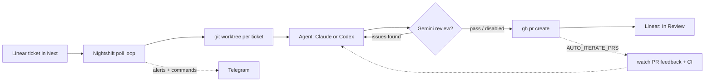

# 🌙 Nightshift

> Move tickets to Next. Go to sleep. Wake up to PRs.

[](https://github.com/ahmadAlMezaal/nightshift/actions/workflows/ci.yml)
[](https://github.com/ahmadAlMezaal/nightshift/actions/workflows/docker.yml)
[](https://github.com/ahmadAlMezaal/nightshift/releases)
[](LICENSE)
[](go.mod)
[](https://getnightshift.dev)

Nightshift picks up your Linear tickets, implements them with your coding agent of choice — **Claude Code or OpenAI Codex** — and creates PRs, all while you sleep. Iterate on review feedback and CI failures, and drive the whole thing from Telegram.

<!-- TODO(maintainer): drop a ~20s demo GIF here — drag a ticket to "Next" → PR appears — e.g.  -->

---

## How it works

```
You: Move 3 tickets to "Next" → Run nightshift → Go to sleep

Nightshift:
  1. Polls Linear, finds tickets in "Next" (or carrying a trigger label)
  2. Creates an isolated git worktree per ticket
  3. Dispatches your agent backend (Claude Code or OpenAI Codex):
     → Reads the ticket, plans, implements, and self-reviews
     → (Claude + USE_AGENT_TEAMS) a lead agent delegates to teammates in parallel
  4. (If Gemini key provided) Multi-model review gate:
     → Sends diff + ticket to Gemini for independent review
     → If issues found → the agent gets a fix pass → Gemini re-reviews
  5. Pushes branch, creates PR via gh CLI
  6. Moves ticket to "In Review", comments PR link on Linear
  7. Picks up next ticket — and (optionally) keeps iterating on PR feedback + CI

You: Wake up → Review 3 PRs → Merge   (check on it from Telegram any time)
```



---

## Quickstart

The fastest path — local, ~5 minutes:

```bash
go install github.com/ahmadAlMezaal/nightshift/cmd/nightshift@latest
claude            # or: codex login   — authenticate your agent once
gh auth login     # GitHub access for PRs
nightshift setup  # interactive: backend, Linear key, repos → writes .env
nightshift        # start polling
```

Tell each Linear **project** which repo it maps to by adding one line to the project's description:

```
Repo: your-org/your-repo
```

Then drag a ticket into **Next** → Nightshift clones the repo, runs the agent in an isolated worktree, opens a PR, and moves the ticket to **In Review**.

> ⚠️ **The one thing newcomers trip on:** a ticket's Linear **project** must point at the repo where its code lives — via a `Repo:` line in the project description (recommended), or a `repos.json` entry. A wrong/missing mapping means the agent runs in the wrong repo (or none), makes no changes, and the ticket bounces back. See [Repositories](#repositories).

**No hardware?** Skip to [Docker](#docker-any-host--no-go-no-pi) or [Cloud (Fly/Render/Railway/DO)](#cloud-fly--render--railway--digitalocean) — same idea, with API-key auth.

---

## Prerequisites

Nightshift is a single Go binary. Beyond Go for the build, it shells out to a few standard tools at runtime:

| Tool | Install | Purpose |
|------|---------|---------|
| Go 1.23+ | [go.dev/dl](https://go.dev/dl), or `brew install go` / `apt install golang` | Build the binary |
| `claude` **or** `codex` CLI | [Claude Code docs](https://docs.anthropic.com/en/docs/claude-code) (Claude) or `npm i -g @openai/codex` (Codex) | Implementation engine — pick one via `AGENT_BACKEND` (default `claude`) |
| `gh` CLI | `brew install gh` | PR creation |
| `git` | Pre-installed | Worktrees + clone-on-demand |
| Linear API key | [Linear settings → API](https://linear.app/settings/api) | Ticket management |
| Gemini API key | [Google AI Studio](https://aistudio.google.com/apikey) | Optional review gate |

You only need the CLI for the backend you select with `AGENT_BACKEND` — `claude` (default) or `codex`. `nightshift doctor` checks for the right one.

**Authentication:**

```bash
# Authenticate whichever agent backend you use (one-time, on the host):
claude              # Claude Code  (subscription login, or set ANTHROPIC_API_KEY)
codex login         # OpenAI Codex (subscription login, or set OPENAI_API_KEY)

gh auth login       # authenticate gh
```

Nightshift never stores or manages agent credentials — it inherits whatever the selected CLI is already logged into.

---

## Install

Nightshift is a single static binary — pick whichever you prefer:

```bash
# A. Go toolchain (installs the latest tagged release to $GOPATH/bin)
go install github.com/ahmadAlMezaal/nightshift/cmd/nightshift@latest

# B. Prebuilt binary — no Go required
#    Grab the archive for your OS/arch from the Releases page:
#    https://github.com/ahmadAlMezaal/nightshift/releases
#    (linux amd64/arm64/armv7, macOS amd64/arm64), then:
tar -xzf nightshift_*_linux_arm64.tar.gz && sudo mv nightshift /usr/local/bin/

# C. Build from source
git clone https://github.com/ahmadAlMezaal/nightshift.git
cd nightshift && go build -o nightshift ./cmd/nightshift
```

Run `nightshift version` to confirm the build.

## Setup

```bash
# 1. With nightshift on your PATH (or ./nightshift if built from source)

# 2. Run the interactive setup wizard
#    Prompts for the agent backend (Claude/Codex), Linear,
#    and optional Gemini/Telegram — then generates .env for you.
./nightshift setup

# 3. Tell each Linear project which repo it maps to —
#    add a "Repo:" line to the project's description (see Repositories).

# 4. Start the poll loop
./nightshift
```

That's it. Move tickets to your trigger state (default: "Next") — or set `TRIGGER_MODE=label` to pick up any ticket carrying a label instead — and watch them become PRs.

Prefer editing config by hand? Copy `.env.example` → `.env` instead of running the wizard, and route repos via the project `Repo:` directive (see [Repositories](#repositories)).

### Docker (any host — no Go, no Pi)

A prebuilt image is published to GHCR with `git`, `gh`, and both agent CLIs baked in. Runs anywhere Docker does — your laptop, a $4 VPS, Railway/Fly/Render.

```bash
# 1. Config: keys via .env; repos routed per-ticket from each Linear
#    project's "Repo: owner/name" directive (see Repositories).
cp .env.example .env            # fill in LINEAR_API_KEY, AGENT_BACKEND, agent + GitHub keys
mkdir -p data                   # /data holds the repos cache, worktrees, logs, PR cursor

# 2. Run
docker run -d --name nightshift --env-file .env -v "$PWD/data:/data" \
  ghcr.io/ahmadalmezaal/nightshift:latest
docker logs -f nightshift       # watch it pick up tickets
```

The project `Repo:` directive covers GitHub repos cloned over HTTPS (authenticated by `GH_TOKEN`). For SSH / non-GitHub URLs, drop an optional `repos.json` at `./data/repos.json` (mapping project name → URL) as a fallback.

Or with Compose: `docker compose up -d` (see [`docker-compose.yml`](docker-compose.yml)).

**Container auth** differs from a logged-in laptop — there's no interactive login, so use API keys / tokens in `.env`:

| Env var | For |
|---------|-----|
| `LINEAR_API_KEY` | Linear (required) |
| `AGENT_BACKEND` | `claude` or `codex` |
| `ANTHROPIC_API_KEY` *or* `OPENAI_API_KEY` | the agent backend you chose |
| `GH_TOKEN` | `gh` PR creation + `git push` (a PAT or fine-grained token with repo + PR scope) |
| `GIT_USER_NAME` / `GIT_USER_EMAIL` | commit identity (defaults to a `Nightshift` bot) |

`GEMINI_API_KEY`, Telegram, and auto-iterate vars work the same as elsewhere. Everything mutable (repos cache, worktrees, logs, PR cursor) lives under the mounted `/data` volume, so restarts keep their state. Stick to **HTTPS**-cloneable repos (a `Repo: owner/name` directive, or HTTPS URLs in any fallback `repos.json`) so `GH_TOKEN` authenticates clones/pushes — SSH would need a mounted key.

### Cloud (Fly · Render · Railway · DigitalOcean)

Always-on, no hardware. Each template deploys the GHCR image; set the same secrets as the Docker table above. Route repos per-ticket with the project `Repo:` directive — no file to mount. For SSH / non-GitHub URLs (where these platforms can't mount a `repos.json` file), supply the fallback registry inline via **`REPOS_JSON`** (the same JSON, as an env var):

```bash
REPOS_JSON='{"repos":{"My Project":{"url":"https://github.com/you/repo.git"}}}'
```

| Platform | File | Deploy |
|----------|------|--------|
| **Fly.io** | [`fly.toml`](fly.toml) | `fly volumes create nightshift_data --size 1` → `fly secrets set …` → `fly deploy` |
| **Render** | [`render.yaml`](render.yaml) | New → Blueprint → pick repo → fill secret env vars |
| **Railway** | [`railway.json`](railway.json) | New → Deploy from repo (builds the Dockerfile); add a `/data` volume + variables |
| **DigitalOcean** | [`deploy/digitalocean-cloud-init.yaml`](deploy/digitalocean-cloud-init.yaml) | Paste into a droplet's *User data* (read the secrets warning in the file) |

All four persist `/data` (Fly volume / Render disk / Railway volume / droplet disk) so restarts keep state.

### Raspberry Pi

Easiest: download the prebuilt **`linux_arm64`** (Pi 4 / 5, 64-bit OS) or **`linux_armv7`** (Pi 3 / 32-bit OS) archive from the [Releases page](https://github.com/ahmadAlMezaal/nightshift/releases) — no Go toolchain on the Pi needed.

Prefer to cross-compile yourself:

```bash
GOOS=linux GOARCH=arm64 go build -o nightshift ./cmd/nightshift            # Pi 4 / 5
GOOS=linux GOARCH=arm GOARM=7 go build -o nightshift ./cmd/nightshift      # Pi 3 / 32-bit
scp nightshift pi@your-pi:/srv/nightshift/
```

### Cutting a release

Releases are automated by [GoReleaser](https://goreleaser.com) (`.goreleaser.yaml` + `.github/workflows/release.yml`). Push a semver tag and a GitHub Release with cross-compiled archives + checksums is published automatically:

```bash
git tag v2.0.0 && git push origin v2.0.0
```

---

## Operating the service

Running Nightshift as a long-lived `systemd --user` service? The `Makefile` wraps the day-to-day operations so you don't have to remember the raw `systemctl` / build incantations (run `make help` to list everything):

| Command | What it does |
|---------|--------------|
| `make update`  | **Pull latest, rebuild, restart.** Builds to a side file and atomically swaps the binary, so a failed build never leaves you without one and the swap is safe while the old process is still running. This is how you upgrade. |
| `make restart` | Restart the service **without** rebuilding |
| `make start` / `make stop` | Start / stop the service |
| `make status`  | Show service status |
| `make logs`    | Tail live logs (`journalctl --user-unit=nightshift.service -f`) |
| `make build-pi`| Cross-compile an `arm64` binary for a Raspberry Pi |

**Upgrading is just `make update` on the host** — it pulls `main`, rebuilds, and restarts in one step.

The startup banner (visible in `make logs` right after a restart) prints the live configuration — active agent backend, review gate, auto-iterate, notifications — so you can confirm at a glance what a freshly-restarted instance is running. If a newer release has been published, the banner is followed by a one-line `🆙 a new version … is available — run 'nightshift update'` hint (and a single Telegram ping if notifications are configured).

### Self-update from a release binary

If you installed Nightshift from a published GitHub Release (rather than running from a git checkout), the binary can upgrade itself npm-style — no `git pull` / rebuild:

```bash
nightshift update            # download the latest release, verify its checksum, swap the binary in place
nightshift update --restart  # …and restart nightshift.service afterwards (systemd --user)
```

`update` queries the latest release via `gh` (which must be installed and authenticated), downloads the archive for your OS/arch, verifies the SHA-256 against the published `checksums.txt`, and atomically replaces the running executable. **It only swaps the binary** — your logs (the config dir's `logs/` and journald) and all runtime state under `~/.nightshift-*` (worktrees, repos, the PR cursor) are left untouched. If the binary lives somewhere you can't write, it tells you to reinstall or re-run with `sudo`. Restart the service yourself afterwards (or pass `--restart`).

```bash
nightshift logs       # tail the service logs (journalctl --user-unit=nightshift.service)
nightshift logs -f    # …and follow
```

`nightshift logs` is the binary's built-in equivalent of `make logs`. Off a systemd host (macOS dev box, Docker) it prints where the per-ticket agent transcripts live and reminds you to use `docker logs` in a container.

### Control the service from the binary

The binary also wraps the `systemd --user` lifecycle directly, so you don't need the `Makefile` (or to remember the unit name) on the host:

```bash
nightshift start     # systemctl --user start nightshift.service
nightshift stop      # …stop
nightshift restart   # …restart
nightshift status    # …status, then print the installed binary version
```

These shell out to `systemctl --user <verb> nightshift.service` and stream its output. `status` appends the running binary's version after the unit status so you can confirm what's installed at a glance. Off a systemd host (macOS dev box, Docker) `systemctl` isn't on PATH, so each prints a clear hint (use `docker start/stop/restart`, or `nightshift run` directly) instead of crashing.

### Shell completion

```bash
nightshift completion bash   # print a bash completion script
nightshift completion zsh    # print a zsh completion script

# install (bash):
nightshift completion bash > /etc/bash_completion.d/nightshift
# install (zsh, anywhere on $fpath):
nightshift completion zsh > "${fpath[1]}/_nightshift"
```

The script completes the subcommand list (`run`, `setup`, `update`, `logs`, `start`, `stop`, `restart`, `status`, `doctor`, `cleanup`, `completion`, `version`, `help`). An unsupported shell argument prints usage and exits non-zero.

### Machine-readable doctor

`nightshift doctor` prints a human report by default; pass `--json` to emit the check results as a JSON array of `{name, ok, detail, hint}` objects (and a non-zero exit when any check fails) for scripting and monitoring:

```bash
nightshift doctor --json
```

---

## Control it from Telegram

Set `TELEGRAM_ENABLED=true` with a bot token + chat ID (the wizard walks you through it) and Nightshift both sends status updates **and** takes commands — a two-way control channel for when you're away from your desk:

| Command | What it does |
|---------|--------------|
| `/status` | Active runs + session stats |
| `/tickets [project] [state]` | Ticket counts by state, or list one state |
| `/ticket ENG-42` | Show a ticket's details |
| `/search-tickets <text>` *(alias `/find`)* | Search Linear tickets by text |
| `/requeue ENG-42 [context]` | Re-queue a blocked/failed ticket, optionally with extra context |
| `/kill ENG-42` | Stop a running ticket |
| `/help` | List all commands |

Only your configured chat can issue commands. `TELEGRAM_VERBOSE=true` also pings on every dispatch (otherwise: terminal events only).

---

## Repositories

Nightshift picks the target repo **per-ticket**, from the ticket's Linear **project** — so you never have to edit config to switch projects.

### Recommended: the project `Repo:` directive

Add a `Repo:` line to the Linear **project's description** and Nightshift routes every ticket in that project to that repo. No config file, no wizard, no redeploy — it lives entirely in Linear:

```
In the Linear project's description:
Repo: your-org/your-repo
Branch: main   (optional — defaults to the repo's default branch)
```

- `Repo:` accepts `owner/name` (expanded to a GitHub HTTPS URL) **or** a full `https://…`/`ssh://…` git URL verbatim.
- `Branch:` is optional; without it the repo's default branch is auto-detected from `origin/HEAD`.
- When a ticket comes in, Nightshift reads its project description, finds the directive, and **clones the repo on demand** into `~/.nightshift-repos/` (nothing needs to be cloned up front).

This is the primary way to map projects to repos — update the project description in Linear and you're done.

### Optional fallback: `repos.json` / `REPOS_JSON`

For projects without a `Repo:` directive — or repos that need an **SSH key, a GitLab/non-GitHub URL, or a custom clone URL** — you can map project names to repos in a `repos.json` file:

```json
{
  "repos": {
    "Auth Service": { "url": "git@github.com:your-org/auth-service.git", "main_branch": "main" },
    "Web App":      { "url": "https://github.com/your-org/web-app.git" }
  }
}
```

`main_branch` is optional and falls back to `MAIN_BRANCH` in `.env`. On PaaS hosts that can't mount a file, supply the same JSON inline via the **`REPOS_JSON`** env var (it takes precedence over the file).

**Resolution order** at dispatch — Nightshift uses the first that matches:

1. The project's `Repo:` directive (recommended).
2. A `repos.json` / `REPOS_JSON` entry keyed by the project name.
3. `REPO_PATH` from `.env` (single-repo fallback) if set.
4. Otherwise the ticket is skipped with a Linear comment.

- `repos.json` is gitignored (machine-specific) and entirely optional — keep it for the SSH/non-GitHub/PaaS-inline cases above.
- **Auth:** the host running Nightshift needs git access to each repo — an SSH key, or `gh auth login` (HTTPS) / `GH_TOKEN` for GitHub. Nightshift checks access before cloning; the wizard also verifies any `repos.json` entry (`git ls-remote`) before saving.
- Single-repo `.env`-only setups (`REPO_PATH`) keep working unchanged.

---

## Auto-iterate on PR feedback (optional)

By default Nightshift's job ends when the PR is created. Set `AUTO_ITERATE_PRS=true` and it also polls the PRs it created — when new feedback lands **or CI fails**, it re-engages the agent **on the same branch** and pushes a follow-up commit. The PR just updates; no new PR, no lost context.

It picks up all three kinds of review feedback: top-level conversation comments, submitted reviews (`CHANGES_REQUESTED` / non-empty `COMMENTED`), and **inline review-thread comments** — the latter passed with their `file:line` location so the agent knows exactly where each note applies.

It also watches **CI**: once every check on the head commit has completed and at least one failed, Nightshift fetches the failed-step logs and asks the agent to reproduce and fix them. CI is keyed by commit SHA, so it acts at most once per commit. Review feedback and CI fixes share one per-PR iteration budget and, when both are pending, are handled in a single re-engagement.

```env
AUTO_ITERATE_PRS=true
MAX_PR_ITERATIONS=3              # safety cap per PR
PR_POLL_INTERVAL=120             # seconds between PR scans
TRUSTED_REVIEWERS=               # CSV of bots/logins; empty = humans only
```

**Safety guards built in:**
- **Iteration cap.** After `MAX_PR_ITERATIONS` re-engagements on the same PR, Nightshift stops and pings you (Telegram + Linear comment). Prevents flake-loops and stuck reviews from grinding through your API quota.
- **Trusted-reviewer allowlist.** Humans are always trusted. Bots are only acted on if their login is in `TRUSTED_REVIEWERS`. Default is empty = humans only — bot reviews are still seen and logged, but Nightshift won't act on them blindly. (The default exists because a bot reviewer once confidently misread a `golangci-lint` v2 config as v1; applying its "fix" would have broken CI.)
- **Cursor persistence.** State at `~/.nightshift-state.json` tracks how far the watcher has caught up (last comment/review timestamps + last CI commit SHA). Restarts don't re-react to historical comments or already-handled CI failures.
- **Telegram heads-up** on each re-engage (always — not gated by `TELEGRAM_VERBOSE`).

Disabled by default; set `AUTO_ITERATE_PRS=true` to opt in, or run the wizard.

---

## Configuration

Run `./nightshift setup` to generate config, or copy `.env.example` → `.env` by hand. Repos are routed per-ticket from each Linear project's `Repo:` directive (see [Repositories](#repositories)) — not from `.env`.

| Variable | Default | Description |
|----------|---------|-------------|
| `LINEAR_API_KEY` | *(required)* | Your Linear personal API key |
| `LINEAR_TEAM_KEY` | `ENG` | Team identifier — the prefix before ticket numbers (e.g. `ENG` for `ENG-42`) |
| `AGENT_BACKEND` | `claude` | Coding agent: `claude` or `codex` |
| `TRIGGER_MODE` | `state` | Pick up work by `state` (column) or `label` |
| `TRIGGER_STATE` | `Next` | Column to watch (state mode) |
| `TRIGGER_LABEL` | *(empty)* | Label to watch (label mode); removed after dispatch |
| `IN_REVIEW_STATE` | `In Review` | State set after the PR is created |
| `REPO_PATH` | *(empty)* | Last-resort fallback repo for tickets whose project has no `Repo:` directive or `repos.json` entry |
| `MAIN_BRANCH` | `main` | Default base branch (overridden per-repo by the project `Branch:` directive or `repos.json` `main_branch`) |
| `MAX_CONCURRENT` | `3` | Max tickets processed simultaneously |
| `POLL_INTERVAL` | `30` | Seconds between Linear polls |
| `USE_AGENT_TEAMS` | `false` | Claude-only: enable Agent Teams (multi-agent parallelism) |
| `GEMINI_API_KEY` | *(empty)* | Enables the review gate; empty = skip it |
| `MAX_REVIEW_RETRIES` | `1` | Fix passes after Gemini flags issues |

Telegram + auto-iterate vars are covered in their own sections below. State/label names are **case-sensitive** — match your Linear board exactly.

---

## Quality knobs

Two independent toggles shape each run; default is both off (single agent, no review gate) — the simplest, cheapest setup.

| Knob | Off (default) | On |
|------|---------------|-----|
| `USE_AGENT_TEAMS` *(Claude only)* | one agent session per ticket — fast, cheap, runs anywhere incl. Raspberry Pi | a lead Claude agent delegates implementation/tests/review to teammates in parallel — better on complex tickets |
| `GEMINI_API_KEY` | no external review | Gemini reviews the diff before the PR; the agent gets fix passes if it fails |

### The Gemini review gate

A second model has different blind spots than the one that wrote the code, so it catches bugs the implementer misses. When `GEMINI_API_KEY` is set, Nightshift sends the `git diff` + ticket to Gemini, which returns `VERDICT: PASS`/`FAIL` + comments. On FAIL the agent gets `MAX_REVIEW_RETRIES` fix passes (Gemini re-reviews each); if it still fails, the PR is created anyway with the unresolved comments in the body. Uses the Gemini API (~$0.01–$0.05/ticket with `gemini-2.5-pro`). Leave the key empty to skip it — addable later with no other changes.

---

## Linear State Flow

```
[Next] ──────────→ [In Progress] ──────────→ [In Review] ──────→ [Done]
  ↑                     │                          │
  │    BLOCKED or        │   PR created             │   You merge
  └────← no changes ←───┘                          └──────────────→
```

- **Next** → Nightshift picks up the ticket
- **In Progress** → the agent is working on it
- **In Review** → PR created, waiting for your review
- **Done** → You merge the PR (Nightshift doesn't touch this)

If the agent gets stuck or makes no changes, the ticket is moved back to **Next** with a comment explaining why.

---

## Writing Good Tickets

Nightshift is only as good as your tickets. See the [`writing-good-tickets` skill](.claude/skills/writing-good-tickets/SKILL.md) for a full guide.

**The one-line rule:** the agent needs to know *what* to change, *where* to change it, and *how you'll know it's done*.

**Good ticket:**
> Login endpoint returns 500 when refresh token is expired. Should return 401 and clear the session cookie. See `auth.controller.ts` line 42. Tests in `auth.controller.spec.ts`. Acceptance: existing tests pass, new test covers the expired token case.

**Bad ticket:**
> Fix the auth bug

---

## Security

### Unattended, no-confirmation execution

Nightshift runs the agent CLI in full-autonomy mode — `claude --dangerously-skip-permissions`, or `codex exec --dangerously-bypass-approvals-and-sandbox` for the Codex backend. Either way, the agent can read, write, and execute commands in your repository without asking for confirmation on each action.

**Only use Nightshift on repositories where you accept this risk:**
- ✅ Personal projects and side projects
- ✅ Dedicated feature branches on team repos (with PR review before merge)
- ❌ Repos with secrets or credentials checked in
- ❌ Repos connected to production infrastructure with write access

### Running in a container

For extra safety, run Nightshift in a Docker container with your repo mounted:

```bash
docker run -it \
  -v $HOME/.nightshift-repos:/root/.nightshift-repos \
  -v $HOME/.nightshift-worktrees:/root/.nightshift-worktrees \
  -v $(pwd):/srv/nightshift \
  -w /srv/nightshift \
  -e LINEAR_API_KEY=... \
  ubuntu:22.04 \
  /srv/nightshift/nightshift
```

### Gemini API note

If `GEMINI_API_KEY` is configured, your git diffs and ticket descriptions are sent to Google's Gemini API. Do not use the review gate on repositories containing secrets, proprietary algorithms, or other sensitive intellectual property.

---

## FAQ

### Where is the Nightshift website?

The project website and landing page are at [getnightshift.dev](https://getnightshift.dev).

### Is this safe to run on my production repo?

Nightshift creates PRs — it doesn't merge them. You review and merge manually. The risk is in what the agent writes during implementation, not in what Nightshift does with it. Use PR review as your safety gate. For extra isolation, run in a container.

### How much does it cost?

**Agent backend:** With `AGENT_BACKEND=claude` (default) it uses the `claude` CLI on your Claude Code subscription; with `codex`, the `codex` CLI on your ChatGPT subscription (or `OPENAI_API_KEY`). Either way it's the CLI's own auth/billing — Nightshift adds no implementation API costs of its own. (Agent Teams uses more tokens per ticket since multiple agents run at once.)

**Gemini:** Only if you enable the review gate — pay-per-token, ~$0.01–$0.05/ticket with `gemini-2.5-pro` ([pricing](https://aistudio.google.com/pricing)).

### Can I run multiple repos simultaneously?

Yes — that's built in. Give each Linear project a `Repo:` directive in its description (or a `repos.json` entry) and a single Nightshift instance routes every ticket to the right repo automatically. Tickets for different repos run concurrently up to `MAX_CONCURRENT`. See [Repositories](#repositories).

### What if the agent gets stuck?

It outputs `BLOCKED: <reason>` and stops. Nightshift posts the blocker as a Linear comment and moves the ticket back to your trigger state. Add context and re-queue it (from the ticket or via `/requeue` on Telegram).

### What are Agent Teams?

A Claude-only experimental mode (`USE_AGENT_TEAMS=true`) where a lead Claude agent delegates subtasks (implementation, tests, review) to teammates in parallel — faster on complex tickets, more tokens. Requires a recent `claude` CLI. Not applicable to the Codex backend.

### The agent crashed mid-task. How do I clean up?

```bash
./nightshift cleanup           # interactive — pick what to remove
./nightshift cleanup --force   # non-interactive — remove everything stale
```

Cleanup iterates every registered repo, deletes merged branches, force-deletes unmerged `nightshift/*` branches that don't have an open PR, prunes worktrees, and clears agent logs older than 7 days.

---

## Contributing

PRs welcome — bug fixes, new deploy targets, or new agent / project-management / git backends. See [CONTRIBUTING.md](CONTRIBUTING.md) for dev setup (`make build` / `test` / `vet`) and the project layout, and [CODE_OF_CONDUCT.md](CODE_OF_CONDUCT.md). Fun fact: Nightshift implements many of its own tickets.

---

## Credits

Built with:
- [Claude Code](https://docs.anthropic.com/en/docs/claude-code) by Anthropic — implementation engine (default) + [Agent Teams](https://docs.anthropic.com/en/docs/claude-code/agent-teams)
- [OpenAI Codex](https://github.com/openai/codex) — alternative implementation engine (`AGENT_BACKEND=codex`)
- [Gemini](https://aistudio.google.com) by Google — independent code review
- Inspired by Damian Galarza's agent loop patterns and the broader agentic-coding community

---

*MIT License — use freely, fork boldly, sleep soundly.*
